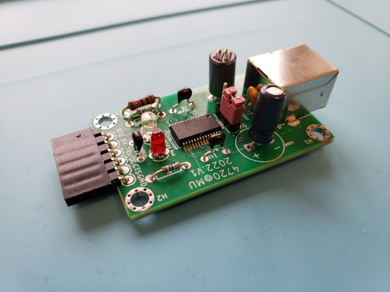

# USB to UART Converter

## Short Description

Design files (KiCAD layout, Arduino testing program, and 3D printing files of 
enclosure in Fusion 360) of a USB to UART converter.

## Details

This repository contains all design files of a USB to UART converter.
The design uses the popular FT232R FTDI chip and its layout was created with
with KiCAD 6.0. The 3D CAD model was created with Autodesk Oct.2022, the free
educators/students version.

All the important design steps that you may want to follow to replicate this
project are described in several youtube videos. This project was split in these 
steps on purpose in order to help students learn for the first time KiCAD layout, 
how to reflow, solder, test, and print a 3D enclosure.

1. [Part 1: Introduction and Objectives](https://www.youtube.com/watch?v=YGBzahBK7fY)

2. [Part 2: Install Software and Design Considerations](https://www.youtube.com/watch?v=YuMDFhPcvQs)

3. [Part 3: Schematic Entry (or Capture)](https://www.youtube.com/watch?v=v7kIc4Z1D-g)

4. [Part 4: Footprint Assignment and Netlist Generation](https://www.youtube.com/watch?v=86rWFbxiwfI)

5. [Part 5: Placement](https://www.youtube.com/watch?v=sIsJZZ_kQxs)

6. [Part 6: Routing](https://www.youtube.com/watch?v=J2sLzAaGzOM)

7. [Part 7: Soldering](https://www.youtube.com/watch?v=Kl9dPHJpTGs)

8. [Part 8: Testing and Programming an Arduino Pro Mini](https://www.youtube.com/watch?v=vrjB3BWouZs)

9. [Part 9: 3D Printed Enclosure Designed in Autodesk Fusion 360](https://youtu.be/6EWKOvSFG48)
